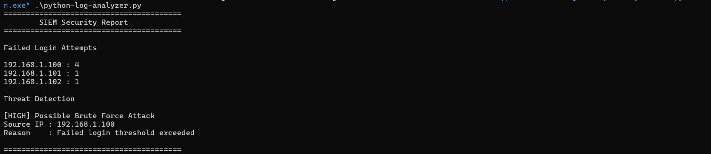

# Incident Report

## Objective

Analyze authentication logs to identify suspicious login activity and possible brute-force attacks.

## Evidence Screenshot




## Findings

- Multiple failed login attempts were detected.
- IP address 192.168.1.100 generated four failed authentication attempts.
- Activity exceeded the detection threshold.


## Severity

HIGH

## Threat Type

Brute Force Authentication Attack

## Evidence

```
192.168.1.100 : 4

[HIGH] Possible Brute Force Attack
Source IP : 192.168.1.100
Reason : Failed login threshold exceeded
```

## Recommendations

- Enable account lockout policies.
- Implement multi-factor authentication (MFA).
- Block suspicious IP addresses.
- Continuously monitor authentication logs.

## Conclusion

The analysis identified suspicious authentication activity indicating a possible brute-force attack. Additional monitoring and preventive controls are recommended.

